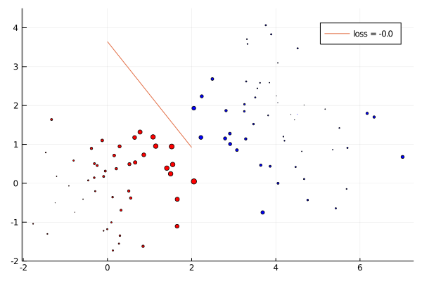

# Sensitivity Analysis of SVM using DiffOpt.jl

This notebook illustrates sensitivity analysis of data points in an [Support Vector Machine](https://en.wikipedia.org/wiki/Support-vector_machine) (inspired from [@matbesancon](http://github.com/matbesancon)'s [SimpleSVMs](http://github.com/matbesancon/SimpleSVMs.jl).)

For reference, Section 10.1 of https://online.stat.psu.edu/stat508/book/export/html/792 gives an intuitive explanation of what does it means to have a sensitive hyperplane or data point. The general form of the SVM training problem is given below (without regularization):

```math
\begin{split}
\begin{array} {ll}
\mbox{minimize} & \sum_{i=1}^{N} \xi_{i} \\
\mbox{s.t.} & \xi_{i} \ge 0 \quad i=1..N  \\
            & y_{i} (w^T X_{i} + b) \ge 1 - \xi[i]\\
\end{array}
\end{split}
```
where
- `X`, `y` are the `N` data points
- `ξ` is the soft-margin loss.

## Define and solve the SVM

Import the libraries.

```@example 1
import Random
using Test
import SCS
import Plots
using DiffOpt
using LinearAlgebra
import MathOptInterface
const MOI = MathOptInterface
nothing # hide
```

Construct separatable, non-trivial data points.
```@example 1
N = 100
D = 2
Random.seed!(6)
X = vcat(randn(N, D), randn(N,D) .+ [4.0,1.5]')
y = append!(ones(N), -ones(N))
nothing # hide
```

Let's define the variables.
```@example 1
(nobs, nfeat) = size(X)

model = diff_optimizer(SCS.Optimizer) 
MOI.set(model, MOI.Silent(), true)

# add variables
l = MOI.add_variables(model, nobs)
w = MOI.add_variables(model, nfeat)
b = MOI.add_variable(model)
nothing # hide
```

Add the constraints.
```@example 1
MOI.add_constraint(
    model,
    MOI.VectorAffineFunction(
        MOI.VectorAffineTerm.(1:nobs, MOI.ScalarAffineTerm.(1.0, l)), zeros(nobs)
    ), 
    MOI.Nonnegatives(nobs)
)

# define the whole matrix Ax, it'll be easier then
# refer https://discourse.julialang.org/t/solve-minimization-problem-where-constraint-is-the-system-of-linear-inequation-with-mathoptinterface-efficiently/23571/4
Ax = Matrix{MOI.ScalarAffineTerm{Float64}}(undef, nobs, nfeat+2)
for i in 1:nobs
    Ax[i, :] = MOI.ScalarAffineTerm.([1.0; y[i]*X[i,:]; y[i]], [l[i]; w; b])
end
terms = MOI.VectorAffineTerm.(1:nobs, Ax)
f = MOI.VectorAffineFunction(
    vec(terms),
    -ones(nobs),
)
MOI.add_constraint(
    model,
    f,
    MOI.Nonnegatives(nobs),
)
nothing # hide
```

Define the linear objective function and solve the SVM model.
```@example 1
objective_function = MOI.ScalarAffineFunction(
                        MOI.ScalarAffineTerm.(ones(nobs), l),
                        0.0,
                    )
MOI.set(model, MOI.ObjectiveFunction{MOI.ScalarAffineFunction{Float64}}(), objective_function)
MOI.set(model, MOI.ObjectiveSense(), MOI.MIN_SENSE)

MOI.optimize!(model)

loss = MOI.get(model, MOI.ObjectiveValue())
wv = MOI.get(model, MOI.VariablePrimal(), w)
bv = MOI.get(model, MOI.VariablePrimal(), b)
nothing # hide
```

We can visualize the separating hyperplane. 

```@example 1
# build SVM points
svm_x = [0.0, 3.0]
svm_y = (-bv .- wv[1] * svm_x )/wv[2]

p = Plots.scatter(X[:,1], X[:,2], color = [yi > 0 ? :red : :blue for yi in y], label = "")
Plots.yaxis!(p, (-2, 4.5))
Plots.plot!(p, svm_x, svm_y, label = "loss = $(round(loss, digits=2))", width=3)
Plots.savefig("svm_separating.svg")
nothing # hide
```


## Experiment 1: Changing the labels

Let's change data point labels `y` without changing the predictors `X`. Construct the perturbations.

```@example 1
ðA = zeros(2*nobs, nobs+nfeat+1)
ðb = zeros(2*nobs)
ðc = zeros(nobs+nfeat+1)

∇ = Float64[]

# begin differentiating
for Xi in 1:nobs
    ðA[nobs+Xi, nobs+nfeat+1] = 1.0
    
    dx, dy, ds = backward(model, ðA, ðb, ðc)
    dl, dw, db = dx[1:nobs], dx[nobs+1:nobs+1+nfeat], dx[nobs+1+nfeat]
    push!(∇, norm(dw)+norm(db))
    
    ðA[nobs+Xi, nobs+nfeat+1] = 0.0
end
LinearAlgebra.normalize!(∇)
nothing # hide
```

Visualize point sensitivities with respect to separating hyperplane. Note that the gradients are normalized.
```@example 1
p2 = Plots.scatter(
    X[:,1], X[:,2], 
    color = [yi > 0 ? :red : :blue for yi in y], label = "",
    markersize = ∇ * 20
)
Plots.yaxis!(p2, (-2, 4.5))
Plots.plot!(p2, [0.0, 2.0], [-bv / wv[2], (-bv - 2wv[1])/wv[2]], label = "loss = $(round(loss, digits=2))")
Plots.savefig("sensitivity2.svg")
nothing # hide
```




## Experiment 2: Changing the data points

Similar to previous example, we can change labels `y` and data points `X` too.
```julia
# constructing perturbations
ðA = zeros(2*nobs, nobs+nfeat+1)
ðb = zeros(2*nobs)
ðc = zeros(nobs+nfeat+1); # c = sum(`l`) + 0'w + 0.b

∇ = Float64[]

# begin differentiating
for Xi in 1:nobs
    ðA[nobs+Xi, nobs.+(1:nfeat+1)] = ones(3)
    
    dx, dy, ds = backward(model, ðA, ðb, ðc)
    dl, dw, db = dx[1:nobs], dx[nobs+1:nobs+1+nfeat], dx[nobs+1+nfeat]
    push!(∇, norm(dw)+norm(db))
    
    ðA[nobs+Xi, nobs.+(1:nfeat+1)] = zeros(3)
end
LinearAlgebra.normalize!(∇)
```

We can visualize point sensitvity with respect to the separating hyperplane. Note that the gradients are normalized.
```@example 1
p3 = Plots.scatter(
    X[:,1], X[:,2], 
    color = [yi > 0 ? :red : :blue for yi in y], label = "",
    markersize = ∇ * 20
)
Plots.yaxis!(p3, (-2, 4.5))
Plots.plot!(p3, [0.0, 2.0], [-bv / wv[2], (-bv - 2wv[1])/wv[2]], label = "loss = $(round(loss, digits=2))")
Plots.savefig(p3, "sensitivity3.svg")
nothing # hide
```


